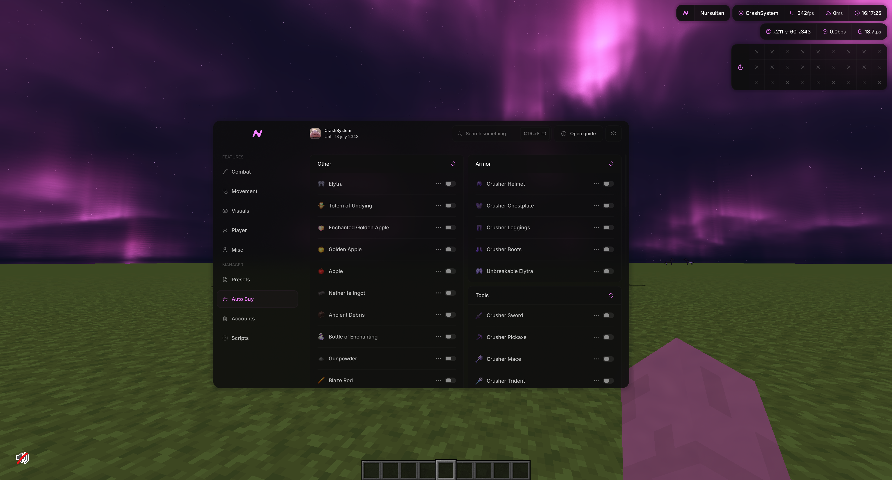
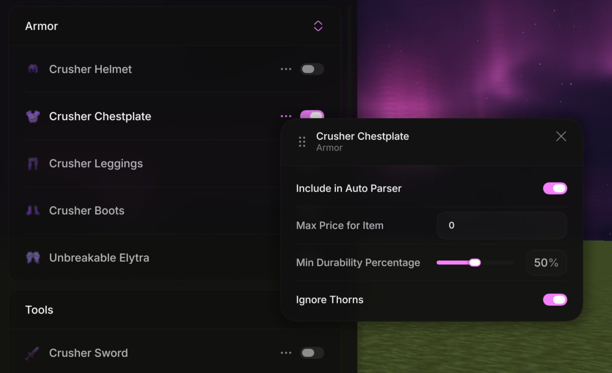
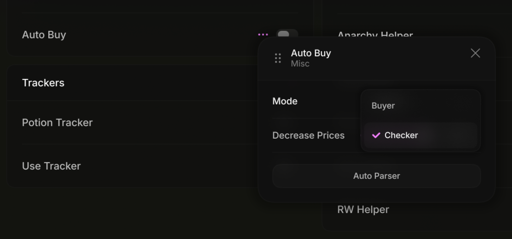
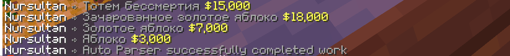

# AutoBuy — how to use it

AutoBuy snipes items off the FT auction for you: you describe once what you want and what you'll pay, and the client finds the listing and takes it faster than you could move the cursor.

It runs on **two clients at the same time**. One scrolls the auction, the other buys. A single client will not work — that is the whole point of the setup: while the checker refreshes `/ah`, the buyer is already opening the seller's listing.

---

## How it works

| Role | What it does |
| --- | --- |
| **Buyer** | Starts a local server and waits. When a match arrives, it runs `/ah <seller>`, finds the listing in their menu and buys it |
| **Checker** | Keeps the auction open, clicks the refresh button, reads price and seller from every listing's lore, and forwards the matching ones to the buyer |

The two clients talk **over the local network**.

Hence the one hard requirement: **both clients must run on the same computer and be the same version** — otherwise they look into different game folders and never find each other.

---

## Before you start

- Two FT accounts, both in a world on an anarchy server.
- Two Nursultan clients of the same version running on one PC.
- Money on the buyer's account. If the balance is below the listing price, the buyer silently skips the match.

---

## Step 1. Build your shopping list

Open the client menu and go to the **"Auto Buy"** tab. Items are grouped into categories: armor, arrows, blocks, consumables, potions, spheres, talismans, tools, other.

The switch on the right of a row adds the item to the list. Disabled items are ignored entirely — the checker never even looks at them.

---

## Step 2. Configure each item

Click the **three dots** on the right of a row (or **right-click** the row) to open its settings.

| Setting | What it does |
| --- | --- |
| **Max Price for Item** | Your price ceiling. Counted **per unit**: a stack of 16 for 32,000 is 2,000 apiece. While this is `0`, the item is never bought |
| **Include in Auto Parser** | Lets the auto-parser overwrite this item's price. On by default |
| **Min Count** | Stackable items only. Listings below that count are skipped |
| **Min Durability Percentage** | Damageable items only. Filters out worn-out armor and tools |
| **Ignore Thorns** | Armor only. Skips pieces enchanted with Thorns |

You can type prices by hand, but the auto-parser is faster.

---

## Step 3. Fill in prices with the auto-parser

The auto-parser walks the auction on its own, checks what the item currently sells for, and writes the result into "Max Price for Item".

The module's own settings live in **Misc → Auto Buy** (the three dots next to the module).

| Setting | What it does |
| --- | --- |
| **Mode** | This client's role: "Buyer" or "Checker" |
| **Decrease Prices** | How many percent to cut off the market price while parsing. 40 % by default |
| **Auto Parser** | Starts the auction sweep |

**How the price is calculated.** The parser runs `/ah search <item>`, collects the prices of every matching listing on the page, converts them to per-unit prices, takes the median, subtracts the "Decrease Prices" percentage and rounds to thousands.

**How to run it:**

1. Enable the Auto Buy module — without it the parser gets no game events.
2. Make sure the two clients aren't linked yet: the parser won't start while a checker is connected to a buyer.
3. Press **"Auto Parser"** and leave the game alone until it finishes.

The parser only visits items that are **enabled** and have **"Include in Auto Parser"** ticked. For every item it prices it logs a line with the name and the new price, and finishes with "Auto Parser successfully completed work".

The parser understands the server's replies: if an item isn't listed it moves on; if the server asks it to wait after joining or complains about AFK, it postpones the item and comes back to it later.

---

## Step 4. Set up the buyer

On the first client:

1. **Misc → Auto Buy**, mode — **"Buyer"**.
2. Join a world on an anarchy server.
3. Enable the module.

The chat prints "AutoBuy is running on port …". That means the local server is up and waiting for a checker.

There is nothing else to do on this client — you don't open the auction, it opens on its own when a match comes in.

---

## Step 5. Set up the checker and go

On the second client:

1. **Misc → Auto Buy**, mode — **"Checker"**.
2. Join a world on an anarchy server.
3. Enable the module — the chat prints "Connected to …", and the buyer sees "Checker … connected".
4. Open the auction: `/ah`, or `/ah search <whatever you're after>`.

From here the client clicks refresh and reads the listings itself. Your job is to leave the menu open.

While the menu is open and the link is alive, **your movement is blocked** — walking and the rest are cut off. That's intended, not a bug: disable the module and control comes back.

---

## What happens on its own

- **Buying.** On a match, the checker forwards the listing to the buyer and pauses so it doesn't bury its partner in finds. The buyer runs `/ah <seller>`, locates the listing and takes it, then closes the menu and tells the checker to resume.
- **Price confirmation.** If the server asks about a suspicious price, the buyer confirms the purchase itself.
- **Balance check.** Listings above the buyer's current balance are skipped.
- **Shulkers.** A shulker is also checked by its contents: if something from your list is inside, the listing counts as a match — priced at the **whole shulker**.
- **Server hopping.** If the auction menu opens too slowly five times in a row, the client moves to the next anarchy server (`/an…`) and waits about 11 seconds before trying again. The checker reopens the auction with the last search you typed.

---

## Chat messages

| Message | Meaning |
| --- | --- |
| `AutoBuy is running on port …` | The buyer's local server is up |
| `Checker … connected` | The checker found the buyer (seen on the buyer) |
| `Connected to …` | The link is established (seen on the checker) |
| `Checker … disconnected` / `Disconnected from …` | The link dropped |
| `Port for AutoBuy not found…` | The checker couldn't find a buyer — see below |
| `Auto Parser successfully completed work` | The auction sweep is done |

---

## If something doesn't work

**"Port for AutoBuy not found…"**
The buyer isn't running, or it started after the checker. Check in order: the second client is open, its mode is "Buyer", it is in a world, the module is enabled, and the chat showed "AutoBuy is running on port …". Order matters: buyer first, checker second.

**The clients don't see each other**
Both must be the same version and run on the same computer — they find each other through a file in the game folder. Different versions mean different folders.

**Nothing gets bought even though listings exist**
Usually the price: "Max Price for Item" is still zero, or below market. Also check that the item's switch is on, that the listing's count isn't below "Min Count", and that durability clears the threshold. And make sure the buyer can actually afford it.

**The auto-parser won't start**
It refuses to run while the clients are linked. Disable the module on one of them, run the parser, then link them back up.

**The auto-parser skipped an item**
That means nothing is listed right now, or no listing passed the checks. The old price is left alone — the parser never writes a zero.

---

## In short

1. Enable the items you want on the "Auto Buy" tab.
2. Run the auto-parser to fill in prices.
3. First client — "Buyer", join a world, enable the module.
4. Second client — "Checker", join a world, enable the module, open `/ah`.
5. Leave the auction open.