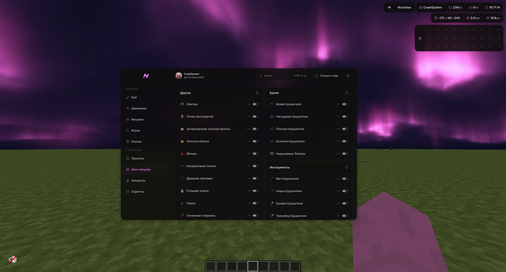
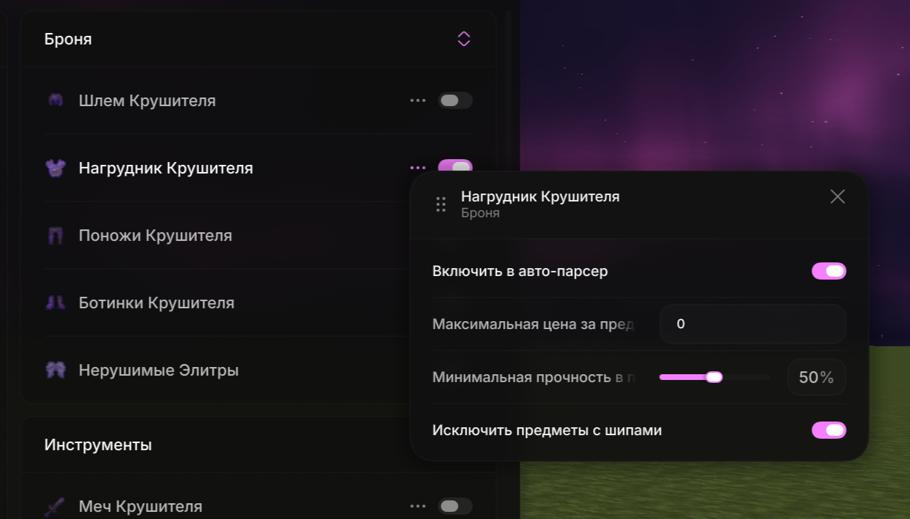
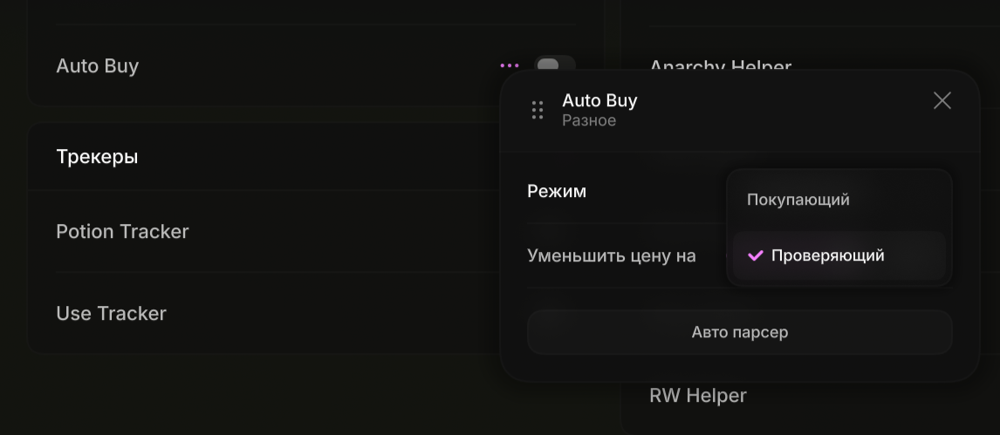
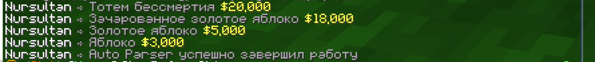

# AutoBuy — как пользоваться

AutoBuy выкупает предметы с аукциона FT автоматически: ты один раз описываешь, что и почём готов брать, а клиент сам находит лот и забирает его быстрее, чем ты успеешь навести курсор.

Работает он **на двух клиентах одновременно**. Один листает аукцион, второй покупает. На одном клиенте AutoBuy не заработает — и это не ограничение, а вся суть схемы: пока проверяющий обновляет `/ah`, покупающий уже открывает лот продавца.

---

## Как это устроено

| Роль | Что делает                                                                                                                           |
| --- |--------------------------------------------------------------------------------------------------------------------------------------|
| **Покупающий** | Поднимает локальный сервер и ждёт. Получив находку — пишет `/ah <ник продавца>`, находит лот в его меню и покупает                   |
| **Проверяющий** | Держит аукцион открытым, жмёт кнопку обновления, читает цену и продавца из описания каждого лота и отправляет подходящие покупающему |

Клиенты общаются между собой **по локальной сети**.

Из этого следует главное требование: **оба клиента должны быть запущены на одном компьютере и быть одной версии** — иначе они смотрят в разные папки игры и не найдут друг друга.

---

## Что нужно перед стартом

- Два аккаунта на FT, оба в мире на анархии.
- Два запущенных клиента Nursultan одной версии на одном ПК.
- Деньги на аккаунте покупающего. Если баланс меньше цены лота, покупающий молча пропустит находку.

---

## Шаг 1. Собери список предметов

Открой меню клиента и перейди на вкладку **«Авто покупка»**. Предметы разложены по категориям: броня, стрелы, блоки, расходники, зелья, сферы, талисманы, инструменты, другое.

Переключатель справа от предмета включает его в список покупок. Выключенные предметы полностью игнорируются — проверяющий их даже не смотрит.

---

## Шаг 2. Настрой каждый предмет

Нажми на **троеточие** справа от предмета (или **ПКМ** по строке) — откроется окно настроек.

| Настройка | Что делает |
| --- | --- |
| **Максимальная цена за предмет** | Потолок цены. Считается **за штуку**: лот из 16 предметов за 32 000 — это 2 000 за штуку. Пока поле равно `0`, предмет не будет куплен никогда |
| **Включить в авто-парсер** | Разрешает авто-парсеру перезаписывать цену этого предмета. Включено по умолчанию |
| **Минимальное кол-во предметов** | Только у стакающихся предметов. Лоты меньше указанного количества пропускаются |
| **Минимальная прочность в процентах** | Только у предметов с прочностью. Отсекает убитую броню и инструменты |
| **Исключить предметы с шипами** | Только у брони. Не берёт вещи с зачарованием «Шипы» |

Цену можно вбить руками, но быстрее — авто-парсером.

---

## Шаг 3. Проставь цены авто-парсером

Авто-парсер сам обойдёт аукцион, посмотрит, почём предмет продают сейчас, и подставит цену в поле «Максимальная цена».

Настройки самого модуля живут в **Разное → Auto Buy** (троеточие у модуля).

| Настройка | Что делает |
| --- | --- |
| **Режим** | Роль этого клиента: «Покупающий» или «Проверяющий» |
| **Уменьшить цену на** | На сколько процентов срезать рыночную цену при парсинге. По умолчанию 40 % |
| **Авто парсер** | Запускает обход аукциона |

**Как считается цена.** Парсер пишет `/ah search <предмет>`, собирает цены всех подходящих лотов на странице, приводит их к цене за штуку, берёт медиану, вычитает процент из «Уменьшить цену на» и округляет до тысяч.

**Порядок запуска:**

1. Включи модуль Auto Buy — без этого парсер не получит игровых событий.
2. Убедись, что клиенты ещё не связаны друг с другом: парсер не стартует, пока проверяющий подключён к покупающему.
3. Нажми **«Авто парсер»** и не трогай игру, пока он не закончит.

Парсер обходит только те предметы, которые **включены** и у которых стоит галочка **«Включить в авто-парсер»**. По каждому найденному предмету он пишет в чат строку с названием и новой ценой, а в конце — «Auto Parser успешно завершил работу».

Парсер понимает ответы сервера: если предмета нет в продаже — идёт дальше; если сервер просит подождать после входа или ругается на AFK — откладывает предмет и вернётся к нему позже.

---

## Шаг 4. Настрой покупающего

На первом клиенте:

1. **Разное → Auto Buy**, режим — **«Покупающий»**.
2. Зайди в мир на анархию.
3. Включи модуль.

В чат придёт «AutoBuy запущен на порте …». Это значит, что локальный сервер поднялся и ждёт проверяющего.

Больше на этом клиенте делать нечего — аукцион открывать не надо, он откроет его сам, когда придёт находка.

---

## Шаг 5. Настрой проверяющего и запусти

На втором клиенте:

1. **Разное → Auto Buy**, режим — **«Проверяющий»**.
2. Зайди в мир на анархию.
3. Включи модуль — в чат придёт «Подключился к …», а покупающему «Проверяющий … подключился».
4. Открой аукцион: `/ah` или `/ah search <что ищешь>`.

Дальше клиент сам жмёт кнопку обновления и читает лоты. Твоё дело — не закрывать меню.

Пока меню открыто и связь жива, **управление персонажем блокируется** — ходьба и т.д. отключены. Это нормально, а не баг: выключи модуль, и управление вернётся.

---

## Что происходит дальше само

- **Покупка.** Найдя подходящий лот, проверяющий отправляет его покупающему и встаёт на паузу, чтобы не завалить напарника находками. Покупающий пишет `/ah <продавец>`, находит нужный лот и забирает его. Потом закрывает меню и говорит проверяющему продолжать.
- **Подтверждение цены.** Если сервер спрашивает про подозрительную цену, покупающий подтверждает покупку сам.
- **Проверка баланса.** Лоты дороже текущего баланса покупающего пропускаются.
- **Шалкеры.** Шалкер проверяется и по содержимому: если внутри лежит предмет из твоего списка, лот считается подходящим — с ценой **всего шалкера**.
- **Смена анархии.** Если меню аукциона пять раз подряд открывается слишком медленно, клиент сам переходит на следующую анархию (`/an…`) и ждёт около 11 секунд перед новой попыткой. Проверяющий при этом переоткроет аукцион с тем же запросом, который ты вводил последним.

---

## Сообщения в чате

| Сообщение | Что означает |
| --- | --- |
| `AutoBuy запущен на порте …` | Покупающий поднял локальный сервер |
| `Проверяющий … подключился` | Проверяющий нашёл покупающего (видно у покупающего) |
| `Подключился к …` | Связь установлена (видно у проверяющего) |
| `Проверяющий … отключился` / `Отключился от …` | Связь разорвана |
| `Порт для AutoBuy не найден…` | Проверяющий не нашёл покупающего — см. ниже |
| `Auto Parser успешно завершил работу` | Обход аукциона закончен |

---

## Если что-то не работает

**«Порт для AutoBuy не найден…»**
Покупающий не запущен или запущен позже проверяющего. Проверь по порядку: второй клиент открыт, режим у него — «Покупающий», он в мире, модуль включён, в чате была строка «AutoBuy запущен на порте …». Порядок важен: сначала покупающий, потом проверяющий.

**Клиенты не видят друг друга**
Оба клиента должны быть одной версии и запущены на одном компьютере — они ищут друг друга через файл в папке игры. Разные версии — разные папки.

**Ничего не покупается, хотя лоты есть**
Чаще всего дело в цене: поле «Максимальная цена за предмет» осталось нулём или ниже рынка. Проверь также, что переключатель предмета включён, что количество в лоте не меньше «Минимального кол-ва», а прочность — не ниже порога. И убедись, что у покупающего хватает денег.

**Авто-парсер не запускается**
Он не стартует, пока клиенты связаны друг с другом. Отключи модуль на одном из них, прогони парсер, потом связывай обратно.

**Авто-парсер пропустил предмет**
Значит, на аукционе его сейчас нет или все лоты не прошли проверку. Старая цена останется нетронутой — парсер никогда не пишет ноль.

---

## Коротко

1. Включить нужные предметы на вкладке «Авто покупка».
2. Прогнать авто-парсер, чтобы проставить цены.
3. Первый клиент — «Покупающий», в мир, включить модуль.
4. Второй клиент — «Проверяющий», в мир, включить модуль, открыть `/ah`.
5. Не закрывать аукцион.